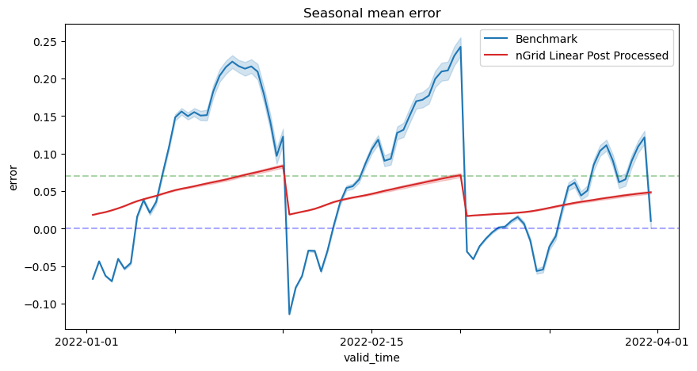

# Neural Networks

This project was developed for [Pontifical Catholic University of Rio de Janeiro](https://www.puc-rio.br/english/)'s master level Neural Networks class.

It develops a post processing pipeline for precipitation numerical forecast for an area in Brazil, coordinates (-23.0, -54.0) and (-16.0, -46.0).

## Results

Using 2021 data between coordinates (-23.0, -54.0) and (-16.0, -46.0) should reach the results shown below.

| Model name   | RMSE   | Improvement |
|--------------|--------|-------------|
| Benchmark    | 0.0789 | 0.00%       |
| Debias       | 0.0704 | 10.79%      |
| Grid Linear  | 0.0444 | 43.81%      |
| nGrid Linear | 0.0448 | 43.28%      |
| Dense (64)   | 0.0433 | 45.12%      |
| Dense (128)  | 0.0433 | 45.13%      |

Probably the best visualization of this results is `nGrid Linear` post processed precipitation for the first three years of 2022, shown below.



### Reproducing Results

The intended pipeline for this project is below. Because it wasn't developed with maintenance in mind, some paths might be hard coded, possibly stopping the flow (e.g. data was moved from `./data/` into `./data/{year}` to create a result visualization), so it might no work for the first time. Therefore, refactoring the code might be needed.

```bash
# conda env export > environment.yml
conda env create -f environment.yml
# download data
python ./neuralnetwork/download # runs __main__.py
python ./neuralnetwork/prepare/combine.py
python ./neuralnetwork/prepare/split_scale.py
# train models
python ./neuralnetworks/train.py
# evaluate and visualization
# both were done under `./neuralnetwork/visualization/results.ipynb`
```

## Troubleshooting

During the project's development, many environment errors were eventually found. If creating directly from `./environment.yml` does not work, one can follow the package installation below.

```bash
conda create -n nnenv python=3.10
conda install pytorch torchvision torchaudio pytorch-cuda=11.8 -c pytorch -c nvidia
conda install xarray cfgrib seaborn pandas h5netcdf dask -c conda-forge
conda install pytorch-lightning -c conda-forge
conda install netcdf4 -c anaconda
conda upgrade xarray
```

## Contact

Whether you are interested in this project and would like to learn more, or would like to contribute, please don't hesitate contacting me.
